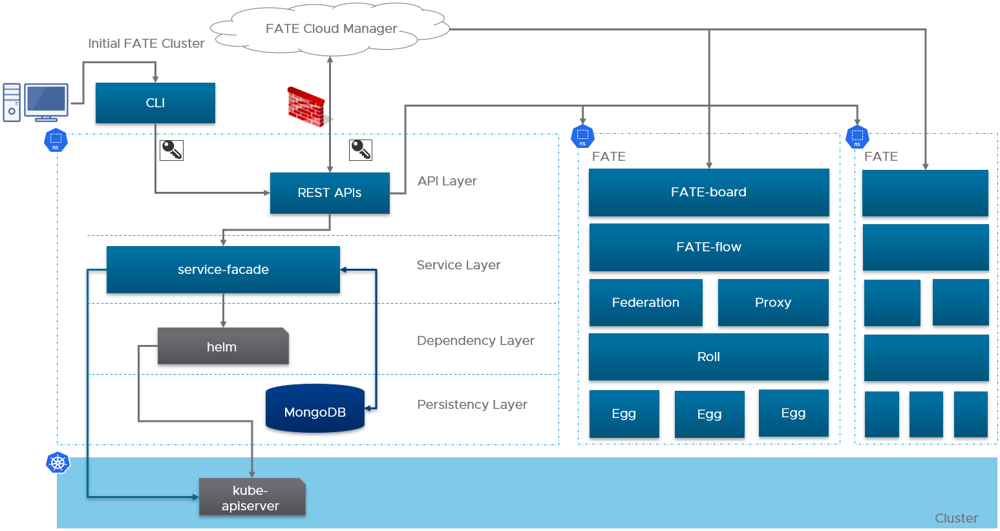
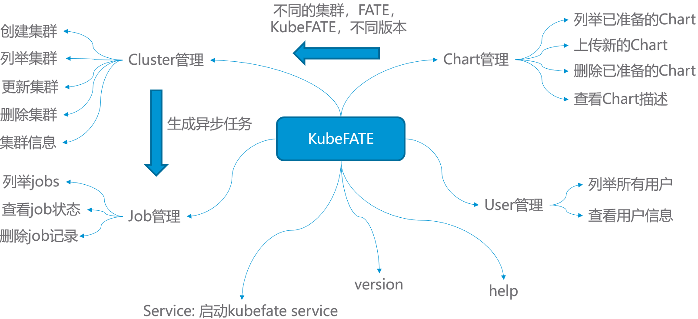
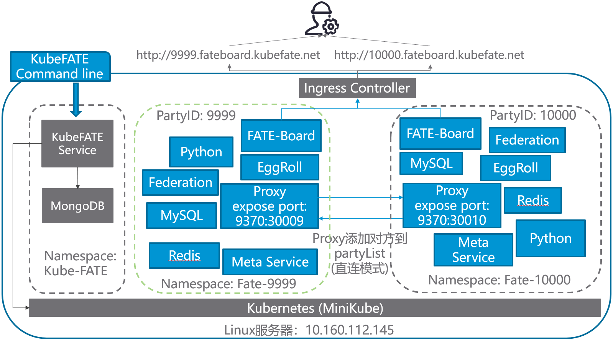

# 使用KubeFATE在Kubernetes上部署联邦学习集群
## 背景及KubeFATE架构
之前我们介绍过如何使用KubeFATE部署一个基于Docker Compose的FATE联邦学习集群，以便于快速尝试体验联邦学习。但随着联邦学习的正式投入使用，训练集、模型都会逐渐变大。在生产环境里，我们会遇到以下问题：
1. FATE集群如何适应企业组织内部各种安全、合规要求，以及网络、安全域等IT环境；
2. 一台服务器已经无法支撑联邦学习的算力需求，如何部署多计算节点，并易于管理；
3. 某些节点出现问题，是否有自愈能力，保证服务的可靠性；
4. 能否实现横向扩展，适应业务的成长；
5. FATE版本能否很好的升级管理；
6. 一个组织内是否可以有不同的联邦集群，对应不同的业务、合作伙伴、应用场景需要，如何管理多个集群。

Kubernetes是目前最流行的基础设施平台，大量的实践证明，Kubernetes很适合作为企业内部运维大规模分布式系统的平台。根据Ovum的统计，截至2019年底，一半的大数据负载都运行在Kubrenetes之上。我们团队也推荐Kubernetes作为运行FATE联邦学习集群生产环境的平台。KubeFATE提供了在Kubernetes部署运维FATE的解决方案。

<div align="center">
  
</div>

KubeFATE的[Kubernetes部署](https://github.com/FederatedAI/KubeFATE/releases/download/v1.3.0-a/kubefate-k8s-v1.3.0-a.tar.gz)分成两大模块：
1. KubeFATE命令行工具：KubeFATE的命令行是一个可执行的二进制文件，用户可以用它快速初始化、部署、管理FATE集群。KubeFATE的命令行可以运行在Kubernetes外，与KubeFATE服务交互。中间使用https协议，可以进行SSL加密，并适配企业的防火墙规则。它的功能模块如下图所示：

<div align="center">
  
</div>

2. KubeFATE服务：KubeFATE服务作为应用部署在Kubernetes上，对外提供Restful APIs，可以容易与企业已有的网管运维等系统进行整合。

## 快速使用KubeFATE在一台Linux服务器上基于MiniKube部署两方联邦学习
为了更好的体验KubeFATE的功能，下面我们会一步一步演示如何使用KubeFATE部署一个两方的联邦学习集群并进行验证。最终的部署结构如下图：

<div align="center">
  
</div>

本文共出现两台机器：
1. 用来做Demo的机器，是一台Linux机器，参照[前置条件第一点](#前置条件);
2. 使用浏览器访问FATE-Board的机器，要求可以访问用来执行Demo的机器。

### 前置条件
1. 一台Linux的服务器，我们测试好的OS版本是Ubuntu 18.04 LTS，由于需要跑多方计算，服务器的推荐配置为：8核，16G内存以上；
2. 两个域名分别给KubeFATE服务和FATE-board使用。如果没有DNS解析条件，可以通过设置hosts方式，后面的介绍基于这种情况；
3. Linux服务器需要预先安装好Docker环境，具体参考[Install Docker in Ubuntu](https://docs.docker.com/install/linux/docker-ce/ubuntu/)；
4. 要保证安装机器可以正常访问Docker Hub，以及Google存储；
5. 预先创建一个目录，以便整个过程使用该目录作为工作目录，命令如下：

```
cd ~ && mkdir demo && cd demo
```

**<div align="center"><font color="red">注意：下文介绍的MiniKube机器IP地址是10.160.112.145。请修改为你准备的实验机器IP地址！！！</font></div>**

### 安装需要的工具
为了使用KubeFATE部署FATE，我们需要以下工具：
1. MiniKube v1.7.3，如果我们已经有Kubernetes环境，可以直接跳转到[部署KubeFATE服务](#部署KubeFATE服务);
2. kubectl v1.17.3：Kubernetes的命令行，需要与具体Kubernetes版本对应，这里的版本是对应MiniKube v1.7.3；
3. KubeFATE:
	* Release: v1.3.1-a
	* 服务版本：v1.0.2
	* 命令行版本：v1.0.2

#### 安装kubectl
```
curl -LO https://storage.googleapis.com/kubernetes-release/release/v1.17.3/bin/linux/amd64/kubectl && chmod +x ./kubectl && sudo mv ./kubectl /usr/bin
```
执行完后可以验证是否成功,
```
layne@machine:~/demo$ kubectl version
Client Version: version.Info{Major:"1", Minor:"17", GitVersion:"v1.17.3", GitCommit:"06ad960bfd03b39c8310aaf92d1e7c12ce618213", GitTreeState:"clean", BuildDate:"2020-02-11T18:14:22Z", GoVersion:"go1.13.6", Compiler:"gc", Platform:"linux/amd64"}
The connection to the server localhost:8080 was refused - did you specify the right host or port?
```
#### 安装MiniKube
```
curl -LO https://github.com/kubernetes/minikube/releases/download/v1.7.3/minikube-linux-amd64 && mv minikube-linux-amd64 minikube && chmod +x minikube && sudo mv ./minikube /usr/bin
```
验证安装结果:`
```
layne@machine:~/demo$ minikube version
minikube version: v1.7.3
commit: 436667c819c324e35d7e839f8116b968a2d0a3ff
```
#### 下载KubeFATE的发布包并安装KubeFATE的命令行
我们从Github上 [KubeFATE Release](https://github.com/FederatedAI/KubeFATE/releases)页面找到Kuberetes部署的下载包，并下载，
```
curl -LO https://github.com/FederatedAI/KubeFATE/releases/download/v1.3.0-a/kubefate-k8s-v1.3.0-a.tar.gz && tar -xzf ./kubefate-k8s-v1.3.0-a.tar.gz
```
然后我们可以查看下下载解压的安装包内容，
```
layne@machine:~/demo$ ls
cluster.yaml  config.yaml  kubefate  kubefate-k8s-v1.3.0-a.tar.gz  kubefate.yaml  rbac-config.yaml
```
由于KubeFATE命令行是可执行二进制文件，可以直接移动到path目录方便使用，
```
chmod +x ./kubefate && sudo mv ./kubefate /usr/bin
```
然后我们测试下kubefate命令是否可用，
```
layne@machine:~/demo$ kubefate version
* kubefate service connection error, Get http://kubefate.net/v1/version: dial tcp: lookup kubefate.net: no such host
* kubefate commandLine version=v1.0.2
```
我们发现获取KubeFATE服务版本报了个错，这是因为我们还没部署KubeFATE的服务；而命令行的版本已经正常显示出来了。

至此，我们需要的工具已经安装完成。
### 使用MiniKube安装Kubernetes
MiniKube支持使用不同的虚拟机来部署Kubernetes，但是在Linux环境下，我们建议直接使用Docker方式。这个方式非常简单，只需要设置```--vm-driver=none```即可。更多的说明参考：[Install MiniKube - Install a Hypervisor](https://kubernetes.io/docs/tasks/tools/install-minikube/#install-a-hypervisor)。
```
sudo minikube start --vm-driver=none
```
根据屏幕指引，稍等一小会。待到命令没有错误返回，我们可以验证下，
```
layne@machine:~/demo$ sudo minikube status
host: Running
kubelet: Running
apiserver: Running
kubeconfig: Configured
```
如果你的显示和上面一样，那恭喜你，一个单节点的Kubernetes已经部署好在你的服务器里了！
但是，还有一个小步骤要做，因为我们KubeFATE通过Ingress向外提供服务，而MiniKube默认并没有启动Ingress模块，所以需要手动启动，
```
sudo minikube addons enable ingress
```
到此，我们的Kubernetes也准备好了。
### 部署KubeFATE服务
#### 创建kube-fate的命名空间以及账号
在我们的安装包里已经包含了相关的yaml文件```rbac-config.yaml```，并且前面的准备工作已解压这个文件到你的工作目录。我们只需要直接执行，
```
kubectl apply -f ./rbac-config.yaml
```
#### 在kube-fate命名空间里部署KubeFATE服务
相关的yaml文件也已经准备在工作目录，直接使用```kubectl apply```，
```
kubectl apply -f ./kubefate.yaml
```
稍等一会，大概10几秒后用下面命令看下KubeFATE服务是否部署好```kubectl get all,ingress -n kube-fate```。如果返回类似下面的信息（特别是pod的```STATUS```显示的是```Running```状态），则KubeFATE的服务就已经部署好并正常运行：
```
layne@machine:~/demo$ kubectl get all,ingress -n kube-fate
NAME                            READY   STATUS    RESTARTS   AGE
pod/kubefate-6d576d6c88-mz6ds   1/1     Running   0          16s
pod/mongo-56684d6c86-4ff5m      1/1     Running   0          16s

NAME               TYPE        CLUSTER-IP       EXTERNAL-IP   PORT(S)     AGE
service/kubefate   ClusterIP   10.111.165.189   <none>        8080/TCP    16s
service/mongo      ClusterIP   10.98.194.57     <none>        27017/TCP   16s

NAME                       READY   UP-TO-DATE   AVAILABLE   AGE
deployment.apps/kubefate   1/1     1            1           16s
deployment.apps/mongo      1/1     1            1           16s

NAME                                  DESIRED   CURRENT   READY   AGE
replicaset.apps/kubefate-6d576d6c88   1         1         1       16s
replicaset.apps/mongo-56684d6c86      1         1         1       16s

NAME                          HOSTS          ADDRESS          PORTS   AGE
ingress.extensions/kubefate   kubefate.net   10.160.112.145   80      16s
```

#### 添加kubefate.net到hosts文件
因为我们要用 kubefate.net 域名来访问KubeFATE服务（该域名在ingress中定义，有需要可自行修改），需要在运行kubefate命令行所在的机器配置hosts文件（注意不一定是Kubernetes所在的机器）。如果网络环境有域名解析服务，可配置kubefate.net域名指向MiniKube机器的IP地址，这样就不用配置hosts文件。注意：下面地址10.160.112.145 要替换为你的MiniKube机器地址。
```
sudo -- sh -c "echo \"10.160.112.145 kubefate.net\"  >> /etc/hosts"
```
添加完毕后，可以验证是否生效：
```
layne@machine:~/demo$ ping -c 2 kubefate.net
PING kubefate.net (10.160.112.145) 56(84) bytes of data.
64 bytes from kubefate.net (10.160.112.145): icmp_seq=1 ttl=64 time=0.080 ms
64 bytes from kubefate.net (10.160.112.145): icmp_seq=2 ttl=64 time=0.054 ms

--- kubefate.net ping statistics ---
2 packets transmitted, 2 received, 0% packet loss, time 1006ms
rtt min/avg/max/mdev = 0.054/0.067/0.080/0.013 ms
```
同时，如果我们重新执行```kubefate version```，显示就会一切正常如下，
```
layne@machine:~/demo$ kubefate version
* kubefate service version=v1.0.2
* kubefate commandLine version=v1.0.2
```
到此，所有准备工作完毕，下面我们可以开始安装FATE了。需要注意的是，上面的工作只需要做一次，后面如果添加、删除、更新FATE集群，上面的不需要重新执行。
### 使用KubeFATE安装FATE
按照前面的计划，我们需要安装两联盟方，ID分别9999与10000。现实情况，这两方应该是完全独立、隔绝的组织，为了模拟现实情况，所以我们需要先为他们在Kubernetes上创建各自独立的命名空间(namespace)。
#### 创建命名空间
我们创建命名空间fate-9999用来部署9999，fate-10000部署10000
```
kubectl create namespace fate-9999
kubectl create namespace fate-10000
```
#### 准备各自的集群配置文件
KubeFATE安装包包含了集群配置的简要配置参考文件```cluster.yaml```，我们可以给每个参与方复制一份来修改配置。如果前面的步骤正确，这个文件已经在工作目录里。运行下面命令复制文件：
```
cp ./cluster.yaml fate-9999.yaml && cp ./cluster.yaml fate-10000.yaml
```
按下面的配置修改fate-9999.yaml，
```
name: fate-9999
namespace: fate-9999
version: v1.3.0-a
partyId: 9999
modules:
  - proxy
  - egg
  - fateboard
  - fateflow
  - federation
  - metaService
  - mysql
  - redis
  - roll
  - python

proxy:
  type: NodePort
  nodePort: 30009
  partyList:
    - partyId: 10000
      partyIp: 10.160.112.145
      partyPort: 30010

egg:
  count: 1

```
主要修改内容有：
1. 删除exchange部分，为了简化配置，这里使用点对点连接的方式；
2. 更改proxy模块的配置，设置监听的端口为30009；
3. 更改partyList部分，配置另外一端10000的proxy的IP与监听端口。注意，这里的```10.160.112.145```需要替换成你的服务器IP地址！端口需要与后面fate-10000.yaml里的proxy所设置的监听端口一致；
4. 把egg的count由3改为1。egg是FATE的计算模块，由于我们用一台服务器模拟，为了节省资源，避免由于资源不够产生的报错，这里建议修改为1。

fate-10000.yaml的配置按照以下修改，
```
name: fate-10000
namespace: fate-10000
version: v1.3.0-a
partyId: 10000
modules:
  - proxy
  - egg
  - fateboard
  - fateflow
  - federation
  - metaService
  - mysql
  - redis
  - roll
  - python

proxy:
  type: NodePort
  nodePort: 30010
  partyList:
    - partyId: 9999
      partyIp: 10.160.112.145
      partyPort: 30009

egg:
  count: 1
```
与fate-9999.yaml的修改类似，
1. 修改name为fate-10000；
2. namespace使用前面为10000方创建的fate-10000；
3. partyId设置为10000；
4. 删除exchange部分；
5. proxy的nodePort修改为30010，这个需要与fate-9999.yaml的partyList信息对应；
6. 修改partyList，使其指向fate-9999.yaml里的proxy配置；
7. 同样修改egg模块的count为1。

如果一切没有问题，那就可以使用```kubefate cluster install```来部署两个fate集群了，
```
layne@machine:~/demo$ kubefate cluster install -f ./fate-9999.yaml
create job success, job id=a3dd184f-084f-4d98-9841-29927bdbf627
layne@machine:~/demo$ kubefate cluster install -f ./fate-10000.yaml
create job success, job id=370ed79f-637e-482c-bc6a-7bf042b64e67
```
这个步骤需要去Docker Hub下载相关镜像，所以具体速度与服务器的网速有很大关系，如果网速快，或者镜像已经准备好在服务器上的话，大概2、3分钟可以部署完成。我们可以使用```kubefate job ls```命令观察部署情况，
```
layne@machine:~/demo$ kubefate job ls
UUID                                    CREATOR METHOD          STATUS  STARTTIME               CLUSTERID
a3dd184f-084f-4d98-9841-29927bdbf627    admin   ClusterInstall  Success 2020-03-10 12:26:39     2a15d783-67cd-4723-8a5c-50eb6355b6b0
370ed79f-637e-482c-bc6a-7bf042b64e67    admin   ClusterInstall  Success 2020-03-10 12:27:06     16270e8a-20b1-43c7-9c6c-385977d8dfc8
```
如果发现STATUS如上面那样变成了Success，证明部署成功完成。
### 验证FATE的部署
#### 执行FATE自带的toy_example进行测试
[toy_example](https://github.com/FederatedAI/FATE/blob/master/examples/toy_example) 是FATE提供的快速测试集群连通性的用例。测试脚本设定10000为host端，9999是guest端。我们采用集群模式执行。这个例子的具体说明可以参见：[toy_example的README](https://github.com/FederatedAI/FATE/blob/master/examples/toy_example/README.md)

FATE规定由guest端发起训练，所以我们需要进入fate-10000的python容器,
```
layne@machine:~/demo$ kubectl get pod -n fate-10000|grep python*
python-dc94c9786-8jsgh          2/2     Running   0          3m13s
```
其中```python-dc94c9786-8jsgh```是python这个pod的ID（注意，下面命令的这个ID需要替换成你执行以上命令返回的具体ID值），我们用```kubectl exec```命令进入该容器，
```
kubectl exec -it python-dc94c9786-8jsgh -n fate-10000 -- /bin/bash
```
并在容器内运行toy_example,
```
(venv) [root@python-dc94c9786-8jsgh python]# cd examples/toy_example/ && python run_toy_example.py 10000 9999 1
stdout:{
    "data": {
        "board_url": "http://fateboard:8080/index.html#/dashboard?job_id=202003110905332206371&role=guest&party_id=10000",
        "job_dsl_path": "/data/projects/fate/python/jobs/202003110905332206371/job_dsl.json",
        "job_runtime_conf_path": "/data/projects/fate/python/jobs/202003110905332206371/job_runtime_conf.json",
        "logs_directory": "/data/projects/fate/python/logs/202003110905332206371",
        "model_info": {
            "model_id": "guest-10000#host-9999#model",
            "model_version": "202003110905332206371"
        }
    },
    "jobId": "202003110905332206371",
    "retcode": 0,
    "retmsg": "success"
}


job status is running
job status is running
job status is running
job status is running
job status is running
job status is running
job status is running
"2020-03-11 09:05:39,911 - secure_add_guest.py[line:101] - INFO: begin to init parameters of secure add example guest"
"2020-03-11 09:05:39,911 - secure_add_guest.py[line:104] - INFO: begin to make guest data"
"2020-03-11 09:05:42,576 - secure_add_guest.py[line:107] - INFO: split data into two random parts"
"2020-03-11 09:05:51,661 - secure_add_guest.py[line:110] - INFO: share one random part data to host"
"2020-03-11 09:05:52,444 - secure_add_guest.py[line:113] - INFO: get share of one random part data from host"
"2020-03-11 09:05:57,566 - secure_add_guest.py[line:116] - INFO: begin to get sum of guest and host"
"2020-03-11 09:05:58,571 - secure_add_guest.py[line:119] - INFO: receive host sum from guest"
"2020-03-11 09:05:58,643 - secure_add_guest.py[line:126] - INFO: success to calculate secure_sum, it is 2000.0"
(venv) [root@python-dc94c9786-8jsgh toy_example]#
```
如果你的输出与上面相似，最后返回```INFO: success to calculate secure_sum, it is xxxx```，即表明训练成功，换言之，也就是FATE-Cluster顺利安装。
#### 查看FATE-Board
KubeFATE会配置FATE-Board以格式```http://${party_id}.fateboard.${serviceurl}```服务。所以：
* FATE-9999的FATE-Board的URL为：http://9999.fateboard.kubefate.net/
* FATE-10000的FATE-Board的URL为：http://10000.fateboard.kubefate.net/

如果我们没有相关的DNS服务，我们需要在访问以上域名的机器，也就是浏览器所在的机器配上相关的hosts，使上面域名指向部署FATE的服务器。在本例子里，就是10.160.112.145，这个需要根据你实际的IP地址来配置。
如果是MacOS或者Linux可以使用以下命令配置，
```
sudo -- sh -c "echo \"10.160.112.145 9999.fateboard.kubefate.net\"  >> /etc/hosts"
sudo -- sh -c "echo \"10.160.112.145 10000.fateboard.kubefate.net\"  >> /etc/hosts"
```
如果是Windows，我们需要把
```
10.160.112.145 9999.fateboard.kubefate.net
10.160.112.145 10000.fateboard.kubefate.net
```
添加到```C:\WINDOWS\system32\drivers\etc\hosts```，具体方法也可以参考相关资料。然后我们就可以用浏览器访问Party-9999和Party-10000的FATE-Board。

##### Party-9999会显示为host端任务完成

<div align="center">
  
</div>

##### Party-10000会显示为guest端任务完成

<div align="center">
  
</div>
